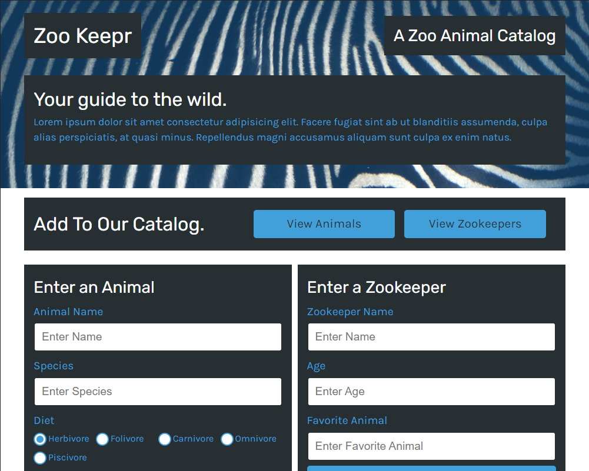

# Zookeepr

## Description

The code contains both the back-end and front-end resources for a zoo database that contains both animals and zookeepers. The functionality includes the ability to add animals and zookeepers to the database and sort them by various queries.

## Table of Contents

- [Installation](#installation)
- [Usage](#usage)
- [Contributing](#contributing)
- [Tests](#tests)
- [Questions](#questions)
  

## Installation

If you download the repository, you will need to install the dependencies before launching it on a local server, which can be done using npm start.

## Usage

You can download and set it up on your own, or you can use this link to see it live in action:
[Heroku Website](https://aqueous-brook-27571.herokuapp.com/)

## Contributing

No contributions are being considered at this time.

## Tests

There are built-in jest tests to show the functionality of the logic. You can also try adding animals and zookeepers as you wish.

## Questions

If you wish to view more of my work, feel free to visit my GitHub account. Additionally, if you have any questions, you can contact me at the email address below. Thanks!

[GitHub](https://github.com/SpencerHulse)

<hulse.spencer@gmail.com>
